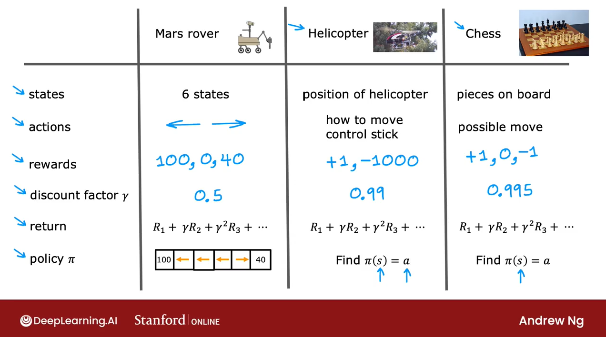

# Machine Project Process

## Loop of ML development

<figure><figcaption></figcaption></figure>

## Data

1. Data augmentation
   1. distortions
2. Synthesis
3. Transfer Learning (supervised pretraining mode -> (fine tuning) ->

## ML project process Cycle

1. Define Project / Scope Project
2. Define & Collect Data
3. Training , error anlayasis, iterative improvement
4. Deploy, monitor and maintain (MLops)
